# Database Schema Documentation

This document provides a comprehensive overview of the database schema used by the fakegaming-bot monorepo.

## Overview

The database is managed using [Sequelize](https://sequelize.org/) ORM with TypeScript decorators. All models are defined in `packages/common/src/models/`.

## Database Support

- **Development:** SQLite (file-based, no setup required)
- **Production:** PostgreSQL (recommended for multi-service deployments)

---

## Entity Relationship Diagram

```mermaid
erDiagram
    UserConfig ||--o| LeagueConfig : "has one"
    UserConfig {
        string discordId PK "Discord User ID"
        string nickname "Optional display name"
        string timezone "User's timezone"
        string defaultReminderTimeSpan "Default reminder duration"
    }
    
    LeagueConfig {
        int id PK
        string discordId FK "References UserConfig"
        string summonerName "League summoner name"
        string region "League region"
        string puuid "Player UUID"
    }
    
    ServerConfig {
        string serverId PK "Discord Guild ID"
        string prefix "Command prefix"
        text welcomeMessage "Optional welcome message"
    }
    
    QuoteConfig {
        string id PK "Unique quote ID"
        string guildId "Discord Guild ID"
        text quote "Quote content"
        string authorId "Discord User ID of quote author"
        string submitterId "Discord User ID of submitter"
        bigint timestamp "Unix timestamp"
    }
    
    ReminderConfig {
        string id PK "Unique reminder ID"
        string userId "Discord User ID"
        string guildId "Discord Guild ID"
        string channelId "Discord Channel ID"
        text message "Reminder message"
        datetime remindAt "When to trigger reminder"
    }
    
    BirthdayConfig {
        string userId PK "Discord User ID"
        int day "Day of month (1-31)"
        int month "Month (1-12)"
        int year "Optional birth year"
        string guildId "Discord Guild ID"
        string channelId "Channel for birthday announcements"
    }
    
    TwitchStreamConfig {
        int id PK
        string twitchUsername "Twitch channel name"
        string discordChannelId "Discord Channel ID for notifications"
        text customMessage "Optional custom notification message"
        int cooldownMinutes "Optional per-config cooldown in minutes"
        string quietHoursStart "Optional quiet-hours start in HH:mm"
        string quietHoursEnd "Optional quiet-hours end in HH:mm"
        datetime lastNotifiedAt "Timestamp of last sent notification for cooldown"
        string guildId "Discord Guild ID"
    }
    
    YoutubeVideoConfig {
        int id PK
        string youtubeChannelId "YouTube Channel ID"
        string discordChannelId "Discord Channel ID for notifications"
        string lastVideoId "Last announced video ID"
        text customMessage "Optional custom notification message"
        int cooldownMinutes "Optional per-config cooldown in minutes"
        string quietHoursStart "Optional quiet-hours start in HH:mm"
        string quietHoursEnd "Optional quiet-hours end in HH:mm"
        datetime lastNotifiedAt "Timestamp of last sent notification for cooldown"
        string guildId "Discord Guild ID"
    }
    
    PatchNoteConfig {
        int id PK
        string game "Game name (e.g., 'league', 'valorant')"
        string title "Patch note title"
        text content "Patch note content"
        string url "Source URL"
        bigint publishedAt "Unix timestamp"
        string logoUrl "Optional game logo URL"
        string imageUrl "Optional patch image URL"
        string version "Optional version string"
        int accentColor "Optional embed color"
    }
    
    PatchSubscriptionConfig {
        int id PK
        string game "Game name"
        string channelId "Discord Channel ID"
        string guildId "Discord Guild ID"
        bigint lastAnnouncedAt "Last announcement timestamp"
    }
    
    DisabledCommandConfig {
        int id PK
        string guildId "Discord Guild ID"
        string commandName "Command to disable"
    }
    
    CacheConfig {
        string key PK "Cache key"
        text value "Cached value (JSON)"
        datetime expiresAt "Expiration timestamp"
    }
```



---

## Table Descriptions

### UserConfig
Stores Discord user configuration and preferences.

**Primary Key:** `discordId` (Discord User ID)

**Fields:**
- `discordId` (STRING, PK) - Unique Discord user identifier
- `nickname` (STRING, nullable) - Optional display name override
- `timezone` (STRING, nullable) - User's timezone (e.g., "America/New_York")
- `defaultReminderTimeSpan` (STRING, nullable) - Default reminder duration (e.g., "1h", "30m")

**Relationships:**
- Has one `LeagueConfig` (one-to-one)

**Use Cases:**
- Store user preferences
- Manage timezones for reminders
- Link to League of Legends accounts

---

### LeagueConfig
Stores League of Legends account information linked to Discord users.

**Primary Key:** `id` (auto-increment)

**Foreign Keys:**
- `discordId` → `UserConfig.discordId` (CASCADE on delete)

**Fields:**
- `id` (INTEGER, PK, auto-increment)
- `discordId` (STRING, FK) - References UserConfig
- `summonerName` (STRING) - League of Legends summoner name
- `region` (STRING) - League region (e.g., "na1", "euw1")
- `puuid` (STRING) - Riot Games Player UUID

**Relationships:**
- Belongs to `UserConfig` (many-to-one)

**Use Cases:**
- Link Discord users to League accounts
- Fetch League stats and match history
- Support `/league-stats` and `/league-history` commands

---

### ServerConfig
Stores per-guild (server) configuration.

**Primary Key:** `serverId` (Discord Guild ID)

**Fields:**
- `serverId` (STRING, PK) - Discord Guild ID
- `prefix` (STRING) - Command prefix (legacy, mostly unused with slash commands)
- `welcomeMessage` (TEXT, nullable) - Optional welcome message for new members

**Use Cases:**
- Store guild-specific settings
- Manage welcome messages

---

### QuoteConfig
Stores user quotes submitted in guilds.

**Primary Key:** `id` (unique quote ID)

**Fields:**
- `id` (STRING, PK) - Unique identifier (UUID)
- `guildId` (STRING) - Discord Guild ID where quote was submitted
- `quote` (TEXT) - The quote content
- `authorId` (STRING) - Discord User ID of the person quoted
- `submitterId` (STRING) - Discord User ID of the person who submitted the quote
- `timestamp` (BIGINT) - Unix timestamp when quote was submitted

**Use Cases:**
- Store memorable quotes from users
- Support `/add-quote`, `/quotes`, `/random-quote`, `/search-quote` commands
- Per-guild quote management

---

### ReminderConfig
Stores user reminders.

**Primary Key:** `id` (unique reminder ID)

**Fields:**
- `id` (STRING, PK) - Unique identifier (UUID)
- `userId` (STRING) - Discord User ID who created the reminder
- `guildId` (STRING) - Discord Guild ID
- `channelId` (STRING) - Discord Channel ID where reminder should be sent
- `message` (TEXT) - Reminder message content
- `remindAt` (DATE) - Timestamp when reminder should trigger

**Use Cases:**
- Schedule future reminders
- Support `/set-reminder` command
- Background job checks for due reminders

---

### BirthdayConfig
Stores user birthdays and announcement preferences.

**Primary Key:** `userId` (Discord User ID)

**Fields:**
- `userId` (STRING, PK) - Discord User ID
- `day` (INTEGER) - Day of month (1-31)
- `month` (INTEGER) - Month (1-12)
- `year` (INTEGER, nullable) - Optional birth year (for age calculation)
- `guildId` (STRING) - Discord Guild ID
- `channelId` (STRING) - Channel for birthday announcements

**Use Cases:**
- Track user birthdays
- Automatic birthday announcements
- Support `/set-birthday`, `/birthday`, `/remove-birthday` commands

---

### TwitchStreamConfig
Stores Twitch stream notification subscriptions.

**Primary Key:** `id` (auto-increment)

**Fields:**
- `id` (INTEGER, PK, auto-increment)
- `twitchUsername` (STRING) - Twitch channel username
- `discordChannelId` (STRING) - Discord Channel ID for notifications
- `customMessage` (TEXT, nullable) - Optional custom notification message
- `cooldownMinutes` (INTEGER, nullable) - Per-config cooldown in minutes
- `quietHoursStart` (STRING, nullable) - Quiet-hours start in HH:mm
- `quietHoursEnd` (STRING, nullable) - Quiet-hours end in HH:mm
- `lastNotifiedAt` (DATE, nullable) - Last sent notification timestamp
- `guildId` (STRING) - Discord Guild ID

**Use Cases:**
- Subscribe to Twitch stream notifications
- Send notifications when streamers go live
- Support `/add-twitch-stream` command

---

### YoutubeVideoConfig
Stores YouTube channel notification subscriptions.

**Primary Key:** `id` (auto-increment)

**Fields:**
- `id` (INTEGER, PK, auto-increment)
- `youtubeChannelId` (STRING) - YouTube Channel ID
- `discordChannelId` (STRING) - Discord Channel ID for notifications
- `lastVideoId` (STRING, nullable) - Last announced video ID (to prevent duplicates)
- `customMessage` (TEXT, nullable) - Optional custom notification message
- `cooldownMinutes` (INTEGER, nullable) - Per-config cooldown in minutes
- `quietHoursStart` (STRING, nullable) - Quiet-hours start in HH:mm
- `quietHoursEnd` (STRING, nullable) - Quiet-hours end in HH:mm
- `lastNotifiedAt` (DATE, nullable) - Last sent notification timestamp
- `guildId` (STRING) - Discord Guild ID

**Use Cases:**
- Subscribe to YouTube channel notifications
- Announce new videos
- Support `/add-youtube-channel` command

---

### PatchNoteConfig
Stores game patch notes (League, Valorant, TFT, etc.).

**Primary Key:** `id` (auto-increment)

**Fields:**
- `id` (INTEGER, PK, auto-increment)
- `game` (STRING) - Game identifier (e.g., "league", "valorant", "tft")
- `title` (STRING) - Patch note title
- `content` (TEXT) - Patch note content
- `url` (STRING) - Source URL
- `publishedAt` (BIGINT) - Unix timestamp
- `logoUrl` (STRING, nullable) - Game logo URL
- `imageUrl` (STRING, nullable) - Patch image URL
- `version` (STRING, nullable) - Version number (e.g., "13.24")
- `accentColor` (INTEGER, nullable) - Discord embed color

**Unique Constraint:** `(game, title)` - Prevents duplicate patch notes

**Use Cases:**
- Store patch notes fetched from game websites
- Support `/get-patchnotes` command
- Background job scrapes patch notes

---

### PatchSubscriptionConfig
Stores guild subscriptions to game patch notes.

**Primary Key:** `id` (auto-increment)

**Unique Constraint:** `(game, channelId)` - One subscription per game per channel

**Fields:**
- `id` (INTEGER, PK, auto-increment)
- `game` (STRING) - Game identifier
- `channelId` (STRING) - Discord Channel ID for announcements
- `guildId` (STRING) - Discord Guild ID
- `lastAnnouncedAt` (BIGINT, nullable) - Last announcement timestamp

**Use Cases:**
- Subscribe channels to automatic patch note announcements
- Support `/subscribe-patchnotes` command
- Background job sends patch notes to subscribed channels

---

### DisabledCommandConfig
Stores disabled commands per guild.

**Primary Key:** `id` (auto-increment)

**Fields:**
- `id` (INTEGER, PK, auto-increment)
- `guildId` (STRING) - Discord Guild ID
- `commandName` (STRING) - Command to disable (e.g., "/poll", "/roll")

**Use Cases:**
- Allow guild admins to disable specific commands
- Command handler checks this table before execution

---

### CacheConfig
Generic key-value cache with expiration.

**Primary Key:** `key` (cache key string)

**Fields:**
- `key` (STRING, PK) - Unique cache key
- `value` (TEXT) - Cached value (typically JSON)
- `expiresAt` (DATE, nullable) - Expiration timestamp

**Use Cases:**
- Cache API responses (Discord guilds, channels, etc.)
- Reduce external API calls
- TTL-based cache invalidation

---

## Migrations

All schema changes are managed through migrations in the `migrations/` directory. See [MIGRATIONS.md](./MIGRATIONS.md) for details on creating and running migrations.

**Key Principles:**
- Never modify models directly without a migration
- All migrations must have `up` and `down` functions
- Migrations run automatically on bot/API startup
- Use descriptive migration names with dates

---

## Data Types

- **STRING** - Variable-length string (VARCHAR)
- **TEXT** - Long text (TEXT)
- **INTEGER** - 32-bit integer
- **BIGINT** - 64-bit integer (used for timestamps and Discord snowflakes)
- **DATE** - Timestamp (DATE/DATETIME)

---

## Indexing Strategy

**Current Indexes:**
- Primary keys (automatic)
- Unique constraints on `PatchNoteConfig(game, title)`
- Unique constraints on `PatchSubscriptionConfig(game, channelId)`

**Recommended Future Indexes** (for performance):
- `QuoteConfig.guildId` - For fast quote retrieval by guild
- `QuoteConfig.authorId` - For fast quote retrieval by author
- `ReminderConfig.remindAt` - For fast due reminder queries
- `TwitchStreamConfig.guildId` - For guild-specific stream lookups
- `YoutubeVideoConfig.guildId` - For guild-specific video lookups
- `DisabledCommandConfig(guildId, commandName)` - Composite index for fast command checks

---

## Testing

Database models are tested in `packages/common/src/models/__tests__/`. Each model has unit tests covering:
- CRUD operations (Create, Read, Update, Delete)
- Validation rules
- Relationships (foreign keys, associations)
- Unique constraints

Run tests with:
```bash
pnpm test
pnpm test:coverage  # With coverage report
```

---

## Backup & Migration

**Development (SQLite):**
- Database stored in `data/dev.sqlite` (or `data/bot/dev.sqlite`)
- Backup: Simply copy the `.sqlite` file

**Production (PostgreSQL):**
- Use `pg_dump` for backups
- Automated backups recommended via Docker volumes or managed database services

---

## References

- [Sequelize Documentation](https://sequelize.org/)
- [Sequelize TypeScript](https://github.com/sequelize/sequelize-typescript)
- [MIGRATIONS.md](./MIGRATIONS.md) - Migration guide
- [ARCHITECTURE.md](./ARCHITECTURE.md) - Architecture patterns
