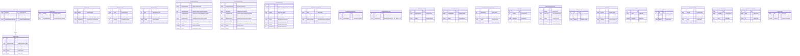

# Database Schema Overview

This document provides a high-level overview of the database schema used by the fakegaming-bot monorepo. It is not the column-level source of truth.

## Overview

The database is managed using [Sequelize](https://sequelize.org/) ORM with TypeScript decorators. Live models are defined in `packages/common/src/models/`.

## Source of Truth

- Models: `packages/common/src/models/`
- Model registration: `packages/common/src/sequelize.ts`
- Migrations: `migrations/`
- API validation schemas: `packages/common/src/api/schemas.ts`
- Generated API docs: `docs/generated/api.md`

## Database Support

- **Development:** SQLite (file-based, no setup required)
- **Production:** PostgreSQL (recommended for multi-service deployments)

---

## Entity Relationship Diagram

This diagram is intentionally condensed around the main configuration and operations tables. Inspect the model files and migrations for exact fields, indexes, and constraints.


```mermaid
erDiagram
    UserConfig ||--o| LeagueConfig : "has one"
    UserConfig {
        string discordId PK "Discord User ID"
        string nickname "Optional display name"
        string timezone "User's timezone"
        string defaultReminderTimeSpan "Default reminder duration"
    }
    
    LeagueConfig {
        int id PK
        string discordId FK "References UserConfig"
        string summonerName "League summoner name"
        string riotIdGameName "Riot ID game name"
        string riotIdTagLine "Riot ID tag line"
        string region "League region"
        string puuid "Player UUID"
    }
    
    ServerConfig {
        string serverId PK "Discord Guild ID"
        string prefix "Command prefix"
        text welcomeMessage "Optional welcome message"
    }
    
    QuoteConfig {
        string id PK "Unique quote ID"
        string guildId "Discord Guild ID"
        text quote "Quote content"
        string authorId "Discord User ID of quote author"
        string submitterId "Discord User ID of submitter"
        bigint timestamp "Unix timestamp"
    }
    
    ReminderConfig {
        string id PK "Unique reminder ID"
        string userId "Discord User ID"
        string guildId "Discord Guild ID"
        string channelId "Discord Channel ID"
        text message "Reminder message"
        datetime remindAt "When to trigger reminder"
    }
    
    BirthdayConfig {
        string userId PK "Discord User ID"
        int day "Day of month (1-31)"
        int month "Month (1-12)"
        int year "Optional birth year"
        string guildId "Discord Guild ID"
        string channelId "Channel for birthday announcements"
    }
    
    TwitchStreamConfig {
        int id PK
        string twitchUsername "Twitch channel name"
        string discordChannelId "Discord Channel ID for notifications"
        text customMessage "Optional custom notification message"
        int cooldownMinutes "Optional per-config cooldown in minutes"
        string quietHoursStart "Optional quiet-hours start in HH:mm"
        string quietHoursEnd "Optional quiet-hours end in HH:mm"
        datetime lastNotifiedAt "Timestamp of last sent notification for cooldown"
        string guildId "Discord Guild ID"
        boolean paused "Pause notifications"
        boolean isLive "Last known live status"
    }
    
    YoutubeVideoConfig {
        int id PK
        string youtubeChannelId "YouTube Channel ID"
        string discordChannelId "Discord Channel ID for notifications"
        string lastVideoId "Last announced video ID"
        text customMessage "Optional custom notification message"
        int cooldownMinutes "Optional per-config cooldown in minutes"
        string quietHoursStart "Optional quiet-hours start in HH:mm"
        string quietHoursEnd "Optional quiet-hours end in HH:mm"
        datetime lastNotifiedAt "Timestamp of last sent notification for cooldown"
        string guildId "Discord Guild ID"
        boolean paused "Pause notifications"
    }
    
    PatchNoteConfig {
        int id PK
        string game "Game name (e.g., 'league', 'valorant')"
        string title "Patch note title"
        text content "Patch note content"
        string url "Source URL"
        bigint publishedAt "Unix timestamp"
        string logoUrl "Optional game logo URL"
        string imageUrl "Optional patch image URL"
        string version "Optional version string"
        int accentColor "Optional embed color"
    }
    
    PatchSubscriptionConfig {
        int id PK
        string game "Game name"
        string channelId "Discord Channel ID"
        string guildId "Discord Guild ID"
        bigint lastAnnouncedAt "Last announcement timestamp"
        boolean paused "Pause announcements"
    }
    
    DisabledCommandConfig {
        int id PK
        string guildId "Discord Guild ID"
        string commandName "Command to disable"
    }
    
    DisabledModuleConfig {
        int id PK
        string guildId "Discord Guild ID"
        string moduleName "Module to disable (e.g., 'fun', 'admin', 'riot')"
    }

    TikTokStreamConfig {
        int id PK
        string tiktokUsername "TikTok account"
        string discordChannelId "Discord Channel ID"
        string guildId "Discord Guild ID"
        boolean paused "Pause notifications"
    }

    BlueskyPostConfig {
        int id PK
        string blueskyHandle "Bluesky account"
        string discordChannelId "Discord Channel ID"
        string guildId "Discord Guild ID"
        boolean paused "Pause notifications"
    }

    SteamNewsSubscriptionConfig {
        int id PK
        int steamAppId "Steam app ID"
        string appName "Steam app name"
        string discordChannelId "Discord Channel ID"
        string guildId "Discord Guild ID"
        boolean paused "Pause notifications"
    }

    AnimeTitle {
        int id PK
        int anilistId "AniList title ID"
        string titleRomaji "Romaji title"
        string titleEnglish "English title"
        bigint nextAiringAt "Next airing timestamp"
    }

    AnimeSubscriptionConfig {
        int id PK
        int anilistId "AniList title ID"
        string targetType "DM or channel target"
        string userId "Discord User ID"
        string guildId "Discord Guild ID"
        string channelId "Discord Channel ID"
        boolean paused "Pause notifications"
    }

    AnimeEpisode {
        int id PK
        int anilistId "AniList title ID"
        int episode "Episode number"
        bigint airingAt "Episode air time"
    }

    Notification {
        int id PK
        string provider "Provider name"
        string eventId "Provider event ID"
        string guildId "Discord Guild ID"
        string channelId "Discord Channel ID"
        string messageId "Discord message ID"
    }

    JobRun {
        int id PK
        string name "Job name"
        datetime startedAt "Run start"
        datetime finishedAt "Run finish"
        boolean ok "Run success flag"
    }

    AuditEvent {
        int id PK
        string guildId "Discord Guild ID"
        string actorId "Discord actor ID"
        string action "Action name"
    }

    IntegrationHealth {
        int id PK
        string provider "Provider name"
        string configId "Provider config ID"
        string guildId "Discord Guild ID"
        string status "Health status"
        datetime lastCheckedAt "Last check time"
    }

    UserNoteConfig {
        string id PK
        string discordId "Discord User ID"
        string title "Note title"
        text body "Note body"
        boolean pinned "Pinned flag"
    }

    PatchNoteHistoryConfig {
        int id PK
        string game "Game name"
        string title "Patch note title"
        string url "Source URL"
        bigint publishedAt "Unix timestamp"
    }
    
    CacheConfig {
        string key PK "Cache key"
        text value "Cached value (JSON)"
        datetime expiresAt "Expiration timestamp"
    }
```

---

## Table Descriptions

### UserConfig
Stores Discord user configuration and preferences.

**Primary Key:** `discordId` (Discord User ID)

**Fields:**
- `discordId` (STRING, PK) - Unique Discord user identifier
- `nickname` (STRING, nullable) - Optional display name override
- `timezone` (STRING, nullable) - User's timezone (e.g., "America/New_York")
- `defaultReminderTimeSpan` (STRING, nullable) - Default reminder duration (e.g., "1h", "30m")

**Relationships:**
- Has one `LeagueConfig` (one-to-one)

**Use Cases:**
- Store user preferences
- Manage timezones for reminders
- Link to League of Legends accounts

---

### LeagueConfig
Stores League of Legends account information linked to Discord users.

**Primary Key:** `id` (auto-increment)

**Foreign Keys:**
- `discordId` → `UserConfig.discordId` (CASCADE on delete)

**Fields:**
- `id` (INTEGER, PK, auto-increment)
- `discordId` (STRING, FK) - References UserConfig
- `summonerName` (STRING) - League of Legends summoner name
- `riotIdGameName` (STRING, nullable) - Riot ID game name
- `riotIdTagLine` (STRING, nullable) - Riot ID tag line
- `region` (STRING) - League region (e.g., "na1", "euw1")
- `puuid` (STRING) - Riot Games Player UUID

**Relationships:**
- Belongs to `UserConfig` (many-to-one)

**Use Cases:**
- Link Discord users to League accounts
- Fetch League stats and match history
- Support `/league-stats` and `/league-history` commands

---

### ServerConfig
Stores per-guild (server) configuration.

**Primary Key:** `serverId` (Discord Guild ID)

**Fields:**
- `serverId` (STRING, PK) - Discord Guild ID
- `prefix` (STRING) - Command prefix (legacy, mostly unused with slash commands)
- `welcomeMessage` (TEXT, nullable) - Optional welcome message for new members

**Use Cases:**
- Store guild-specific settings
- Manage welcome messages

---

### QuoteConfig
Stores user quotes submitted in guilds.

**Primary Key:** `id` (unique quote ID)

**Fields:**
- `id` (STRING, PK) - Unique identifier (UUID)
- `guildId` (STRING) - Discord Guild ID where quote was submitted
- `quote` (TEXT) - The quote content
- `authorId` (STRING) - Discord User ID of the person quoted
- `submitterId` (STRING) - Discord User ID of the person who submitted the quote
- `timestamp` (BIGINT) - Unix timestamp when quote was submitted

**Use Cases:**
- Store memorable quotes from users
- Support `/add-quote`, `/quotes`, `/random-quote`, `/search-quote` commands
- Per-guild quote management

---

### ReminderConfig
Stores user reminders.

**Primary Key:** `id` (unique reminder ID)

**Fields:**
- `id` (STRING, PK) - Unique identifier (UUID)
- `userId` (STRING) - Discord User ID who created the reminder
- `guildId` (STRING) - Discord Guild ID
- `channelId` (STRING) - Discord Channel ID where reminder should be sent
- `message` (TEXT) - Reminder message content
- `remindAt` (DATE) - Timestamp when reminder should trigger

**Use Cases:**
- Schedule future reminders
- Support `/set-reminder` command
- Background job checks for due reminders

---

### BirthdayConfig
Stores user birthdays and announcement preferences.

**Primary Key:** `userId` (Discord User ID)

**Fields:**
- `userId` (STRING, PK) - Discord User ID
- `day` (INTEGER) - Day of month (1-31)
- `month` (INTEGER) - Month (1-12)
- `year` (INTEGER, nullable) - Optional birth year (for age calculation)
- `guildId` (STRING) - Discord Guild ID
- `channelId` (STRING) - Channel for birthday announcements

**Use Cases:**
- Track user birthdays
- Automatic birthday announcements
- Support `/set-birthday`, `/birthday`, `/remove-birthday` commands

---

### TwitchStreamConfig
Stores Twitch stream notification subscriptions.

**Primary Key:** `id` (auto-increment)

**Fields:**
- `id` (INTEGER, PK, auto-increment)
- `twitchUsername` (STRING) - Twitch channel username
- `discordChannelId` (STRING) - Discord Channel ID for notifications
- `customMessage` (TEXT, nullable) - Optional custom notification message
- `cooldownMinutes` (INTEGER, nullable) - Per-config cooldown in minutes
- `quietHoursStart` (STRING, nullable) - Quiet-hours start in HH:mm
- `quietHoursEnd` (STRING, nullable) - Quiet-hours end in HH:mm
- `lastNotifiedAt` (DATE, nullable) - Last sent notification timestamp
- `guildId` (STRING) - Discord Guild ID
- `paused` (BOOLEAN) - Pauses notifications without deleting the subscription
- `isLive` (BOOLEAN) - Last known live state used by delivery jobs

**Use Cases:**
- Subscribe to Twitch stream notifications
- Send notifications when streamers go live
- Support `/add-twitch-stream` command

---

### YoutubeVideoConfig
Stores YouTube channel notification subscriptions.

**Primary Key:** `id` (auto-increment)

**Fields:**
- `id` (INTEGER, PK, auto-increment)
- `youtubeChannelId` (STRING) - YouTube Channel ID
- `discordChannelId` (STRING) - Discord Channel ID for notifications
- `lastVideoId` (STRING, nullable) - Last announced video ID (to prevent duplicates)
- `customMessage` (TEXT, nullable) - Optional custom notification message
- `cooldownMinutes` (INTEGER, nullable) - Per-config cooldown in minutes
- `quietHoursStart` (STRING, nullable) - Quiet-hours start in HH:mm
- `quietHoursEnd` (STRING, nullable) - Quiet-hours end in HH:mm
- `lastNotifiedAt` (DATE, nullable) - Last sent notification timestamp
- `guildId` (STRING) - Discord Guild ID
- `paused` (BOOLEAN) - Pauses notifications without deleting the subscription

**Use Cases:**
- Subscribe to YouTube channel notifications
- Announce new videos
- Support `/add-youtube-channel` command

---

### PatchNoteConfig
Stores game patch notes for the supported patch-note providers.

**Primary Key:** `id` (auto-increment)

**Fields:**
- `id` (INTEGER, PK, auto-increment)
- `game` (STRING) - Game identifier (currently League of Legends, VALORANT, Marvel Rivals, and Overwatch 2)
- `title` (STRING) - Patch note title
- `content` (TEXT) - Patch note content
- `url` (STRING) - Source URL
- `publishedAt` (BIGINT) - Unix timestamp
- `logoUrl` (STRING, nullable) - Game logo URL
- `imageUrl` (STRING, nullable) - Patch image URL
- `version` (STRING, nullable) - Version number (e.g., "13.24")
- `accentColor` (INTEGER, nullable) - Discord embed color

**Unique Constraint:** `(game, title)` - Prevents duplicate patch notes

**Use Cases:**
- Store patch notes fetched from game websites
- Support `/get-patchnotes` command
- Background job scrapes patch notes

---

### PatchSubscriptionConfig
Stores guild subscriptions to game patch notes.

**Primary Key:** `id` (auto-increment)

**Unique Constraint:** `(game, channelId)` - One subscription per game per channel

**Fields:**
- `id` (INTEGER, PK, auto-increment)
- `game` (STRING) - Game identifier
- `channelId` (STRING) - Discord Channel ID for announcements
- `guildId` (STRING) - Discord Guild ID
- `lastAnnouncedAt` (BIGINT, nullable) - Last announcement timestamp
- `paused` (BOOLEAN) - Pauses automatic announcements without deleting the subscription

**Use Cases:**
- Subscribe channels to automatic patch note announcements
- Support `/subscribe-patchnotes` command
- Background job sends patch notes to subscribed channels

---

### DisabledCommandConfig
Stores disabled commands per guild.

**Primary Key:** `id` (auto-increment)

**Fields:**
- `id` (INTEGER, PK, auto-increment)
- `guildId` (STRING) - Discord Guild ID
- `commandName` (STRING) - Command to disable (e.g., "/poll", "/roll")

**Use Cases:**
- Allow guild admins to disable specific commands
- Command handler checks this table before execution; if disabled, bot denies execution with an ephemeral message.

---

### DisabledModuleConfig
Stores disabled modules per guild (module-level feature toggles).

**Primary Key:** `id` (auto-increment)

**Unique Constraint:** `(guildId, moduleName)` - One disabled record per module per guild

**Fields:**
- `id` (INTEGER, PK, auto-increment)
- `guildId` (STRING) - Discord Guild ID
- `moduleName` (STRING) - Module to disable (e.g., "fun", "admin", "riot")

**Use Cases:**
- Allow guild admins to disable entire modules at once
- Command handler tags each command with `moduleName` and denies execution if the module is disabled (ephemeral response)
- Shared dashboard page manages both disabled commands and modules at `/dashboard/commands/[guildId]`

---

### CacheConfig
Generic key-value cache with expiration.

**Primary Key:** `key` (cache key string)

**Fields:**
- `key` (STRING, PK) - Unique cache key
- `value` (TEXT) - Cached value (typically JSON)
- `expiresAt` (DATE, nullable) - Expiration timestamp

**Use Cases:**
- Cache API responses (Discord guilds, channels, etc.)
- Reduce external API calls
- TTL-based cache invalidation

---

## Additional Model Families

The live model set has grown beyond the original command-only schema. These families are registered in `packages/common/src/sequelize.ts` and should be checked in source before making schema changes:

- Provider notification configs: `TikTokStreamConfig`, `BlueskyPostConfig`, `SteamNewsSubscriptionConfig`, plus paused/cooldown/quiet-hours fields on provider subscriptions.
- Delivery and operations records: `Notification`, `JobRun`, `AuditEvent`, and `IntegrationHealth`.
- Patch-note history: `PatchNoteHistoryConfig` keeps fetched patch-note history separate from channel subscriptions.
- Anime tracking: `AnimeTitle`, `AnimeSubscriptionConfig`, and `AnimeEpisode` store AniList-backed title metadata, subscriptions, and episode air times.
- User notes: `UserNoteConfig` stores dashboard/user note records keyed by Discord user.

---

## Runtime Enforcement (Commands & Modules)

- Before executing any command, the bot checks both `DisabledModuleConfig` (by `moduleName`) and `DisabledCommandConfig` (by `commandName`) for the current `guildId`.
- If a module is disabled, all its commands are denied with an ephemeral message (module-level block).
- If a specific command is disabled (and module is enabled), that command is denied with an ephemeral message (command-level block).
- The dashboard provides a shared management page at `/dashboard/commands/[guildId]` to toggle both disabled modules and disabled commands.

---

## Migrations

All schema changes are managed through migrations in the `migrations/` directory. See [MIGRATIONS.md](./MIGRATIONS.md) for details on creating and running migrations.

**Key Principles:**
- Never modify models directly without a migration
- All migrations must have `up` and `down` functions
- Migrations run during service startup where enabled; production Compose disables bot-side migrations with `DB_MIGRATIONS_ENABLED=0` and lets the API own startup migrations.
- Use descriptive migration names with dates

**Related Migrations:**
- Later migrations add provider health, delivery history, paused state, Steam news, anime tracking, user notes, and Riot ID fields. Check `migrations/` for the exact ordered history.
- `20251016-create-disabled-module-config.ts` — Introduces `DisabledModuleConfig` with unique `(guildId, moduleName)`

---

## Data Types

- **STRING** - Variable-length string (VARCHAR)
- **TEXT** - Long text (TEXT)
- **INTEGER** - 32-bit integer
- **BIGINT** - 64-bit integer (used for timestamps and Discord snowflakes)
- **DATE** - Timestamp (DATE/DATETIME)

---

## Indexing Notes

Consult `migrations/` and the model decorators for the exact current index set. Common index and uniqueness patterns include:

- Primary keys (automatic)
- Unique constraints on `PatchNoteConfig(game, title)`
- Unique constraints on `PatchSubscriptionConfig(game, channelId)`
- Unique constraints on `DisabledModuleConfig(guildId, moduleName)`
- Provider subscription uniqueness per guild/source/channel
- Operational indexes on job runs, audit events, integration health, and user notes

---

## Testing

Database models are tested in `packages/common/src/models/__tests__/`. Each model has unit tests covering:
- CRUD operations (Create, Read, Update, Delete)
- Validation rules
- Relationships (foreign keys, associations)
- Unique constraints

Run tests with:
```bash
pnpm test
pnpm test:coverage  # With coverage report
```

---

## Backup & Migration

**Development (SQLite):**
- Database stored in `data/dev.sqlite` (or `data/bot/dev.sqlite`)
- Backup: Simply copy the `.sqlite` file

**Production (PostgreSQL):**
- Use `pg_dump` for backups
- Automated backups recommended via Docker volumes or managed database services

---

## References

- [Sequelize Documentation](https://sequelize.org/)
- [Sequelize TypeScript](https://github.com/sequelize/sequelize-typescript)
- [MIGRATIONS.md](./MIGRATIONS.md) - Migration guide
- [ARCHITECTURE.md](./ARCHITECTURE.md) - Architecture patterns
